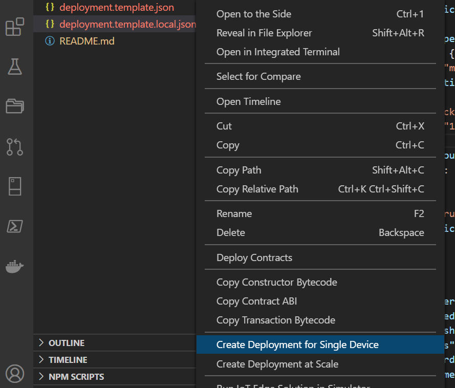
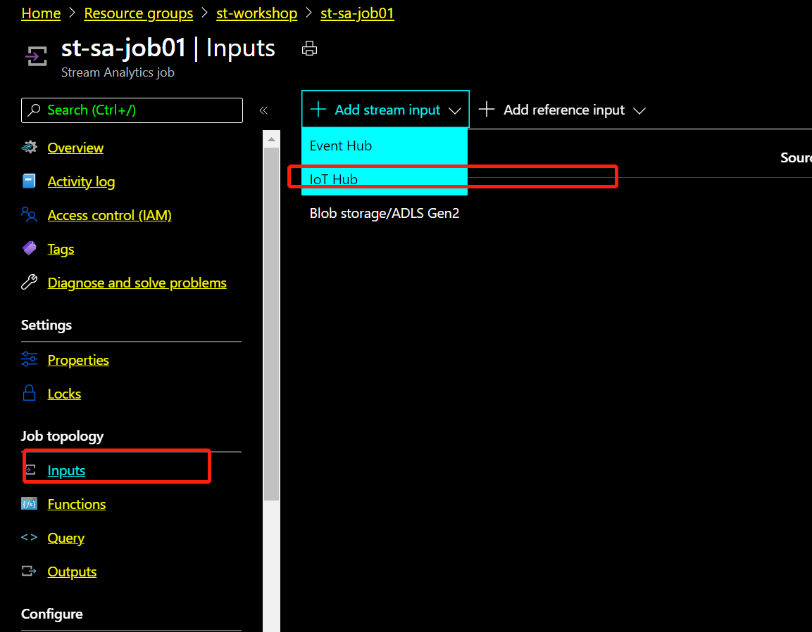

# Configure and deploy IoT Edge on Linux VM

## Lab objectives: 

1. Configure IoT Hub and Edge on Azure Portal
2. Connect your IoT Edge on board to cloud 
3. Set your IoT Edge to install modules
4. Create Stream Analytics to stream your data to cloud PowerBI

## Pre-requisites
* Azure account: 
    Bring your own Azure account to keep all your dev works. 

* Install VS Code:
    https://code.visualstudio.com/download
* Install Azure IoT Explorer:
    https://github.com/Azure/azure-iot-explorer/releases. How to use: https://docs.microsoft.com/en-us/azure/iot-pnp/howto-use-iot-explorer
* Install extensiton for VS code
    Azure IoT tools: https://marketplace.visualstudio.com/items?itemName=vsciot-vscode.azure-iot-tools
    vsciot-vscode.azure-iot-edge
    vsciot-vscode.azure-iot-toolkit

----------------------------------------------------------------------------

## Start IoT Edge from a Linux VM 

Follow the link below: 
https://docs.microsoft.com/en-us/azure/iot-edge/how-to-install-iot-edge?view=iotedge-2020-11

## Configure IoT Hub and Edge on Azure Portal

### Create IoT Hub on Azure Portal 

1. Create IoT Hub. Ignore if you have your own Hub already. Follow below link. 
https://docs.microsoft.com/en-us/azure/iot-hub/iot-hub-create-through-portal?view=iotedge-2018-06

2. Register an IoT Edge device

Create a device identity for your IoT Edge device so that it can communicate with your IoT hub. The device identity lives in the cloud, and you use a unique device connection string to associate a physical device to a device identity.

[Azure Portal] Goes to your IOT Hub, click IoT Edge link in left hand navigator. Click "Add an IoT Edge Device" in top area. 

Input "Device ID": my-iotworkshop-edge01, click "Save".
Reclick the new edge "my-iotworkshop-edge01" created, copy the "primary connection string", save to your notepad to use later. 

### Connect your IoT Edge on board to cloud 

4. Input the previous Edge connection string to config.yaml file below. Also modify hostname.

    PC> sudo cp /etc/aziot/config.toml.edge.template /etc/aziot/config.toml
    PC> sudo vi /etc/aziot/config.toml

    # Manual provisioning with connection string
    [provisioning]
    source = "manual"
    connection_string = "<ADD DEVICE CONNECTION STRING HERE>"

    Then, save config.toml

5. Restart your edge to take effect 

    PC> sudo iotedge config apply

6. Verify success installation 

sudo iotedge system status
sudo iotedge system logs
sudo iotedge check

It will take around 3 - 5 mins for yor edge to download firat IoT Edge module, edgeAgent

6. Some usful commands to check your edge status

    PC> iotedge list 
    PC> iotedge logs -f edgeAgent

### Set your IoT Edge to install modules

1. Open your VS code

Git clone https://github.com/philipcaffeine/azureiot-stm32mp1

2. Connect your VS code to IoT Hub

Copy IoT Hub string from Azure Portal. Open Azure Portal, click your Iot Hub, click "Shared access policies" in left hand side. 
Select "iothubowner", copy the "connection string-primary key" to notepad.

Open your VS code, in command platte, select "Azure IOT Hub, set connection string" 

3. Deployment new edge modules via VS code

Right click to generate the deployment to your edge device.

4. You can watch logs from edgeAgent to check installation progesss as well 

    PC> iotedge logs -f edgeAgent

5. Verify if your IoT Hub is getting telemetry from Edge module to Hub

Open Azure IoT Explorer from your laptop. Add new connection from your previous "IOT Hub conenctrion string" 

Click the previous created Edge from list. Click "Telemetry" from left hand navigator. Click start to monitor the data.

### Create Stream Analytics to stream your data to cloud PowerBI

1. Create Stream Analytics Job in Azure Portal

provide name and region. 

2. Create consumer group in your IoT Hub

Select "Build in endpoint" from IoT Hub, and crreate a new consume group, naming like "stsajob01consume"

3. Configure Stream Analytics Job 

Add "input" from left hand side, select "IoT Hub" 

Leave all default value, just provide "input alias" and select the consumer group just created 

Add "Output", and select "PowerBI"

Authorize with your existing Power BI account, or "Sign up" a free 60 days trial account. 

Add output alias, choose Power BI workspace, input dataset and table name. Select "user token" as authentication method.

Select "Query", and add below query string: 

    SELECT
        machine.temperature as mTemperature, 
        machine.pressure as mPressure, 
        ambient.temperature as aTemperature, 
        ambient.humidity as aHumidity, 
        timeCreated 
    INTO
        [stmp1powerbi] 
    FROM
        [phil-iothub01]

Back to "overview" and click "start". 

4. View streaming dataset in PowerBi.com

Navigate link of https://powerbi.microsoft.com
Sign in with account just created. 

Select your workspace. 

Found there is a new dataset just generated. 

Add new dashboard from it. 

Add a tile in your dashboard

Select real time dataset

Select the new dataset from stmp1 board

Select "clustered column chart", Axis "timeCreated", values as "mTemparature", and time windows as "last 1 minute" to display

You can add more real time tiles into same dashboard as you want. 

