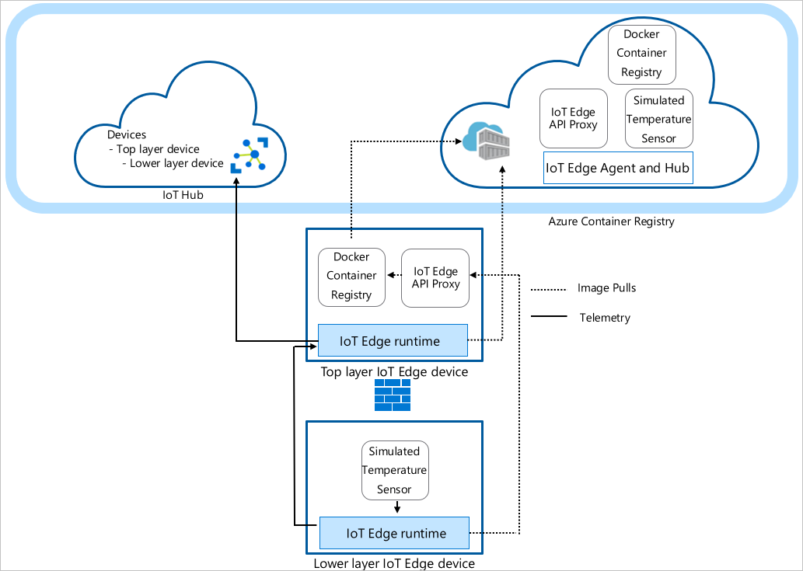

# Tutorial: Create a hierarchy of IoT Edge devices

## Lab objectives: 

1. Create and define the relationships in a hierarchy of IoT Edge devices.
2. Configure the IoT Edge runtime on the devices in your hierarchy.
3. Install consistent certificates across your device hierarchy.
3. Add workloads to the devices in your hierarchy.
4. Use the IoT Edge API Proxy module to securely route HTTP traffic over a single port from your lower layer devices. 

## Pre-requisites
* Azure account: 
    Bring your own Azure account to keep all your dev works. 
* Install VS Code:
    https://code.visualstudio.com/download
* Install Azure IoT Explorer:
    https://github.com/Azure/azure-iot-explorer/releases. How to use: https://docs.microsoft.com/en-us/azure/iot-pnp/howto-use-iot-explorer
* Install extensiton for VS code
    Azure IoT tools: https://marketplace.visualstudio.com/items?itemName=vsciot-vscode.azure-iot-tools
    vsciot-vscode.azure-iot-edge
    vsciot-vscode.azure-iot-toolkit

----------------------------------------------------------------------------

## Tutorial: Create a hierarchy of IoT Edge devices

Follow the link below: 
https://docs.microsoft.com/en-us/azure/iot-edge/tutorial-nested-iot-edge?view=iotedge-2020-11

The topology of the lab

Top layer: IoT Edge devices at this layer can connect directly to the cloud.

Lower layers: IoT Edge devices at layers below the top layer cannot connect directly to the cloud. They need to go through one or more intermediary IoT Edge devices to send and receive data.

### Prepare ssh key for VM

ssh-keygen -m PEM -t rsa -b 4096

### 1. Create and define the relationships in a hierarchy of IoT Edge devices.

1. run in Linux VM  - top tier

az deployment group create  --resource-group mfg-workshop-nestededge  --template-uri "https://raw.githubusercontent.com/Azure/iotedge-vm-deploy/1.2.0/edgeDeploy.json"  --parameters dnsLabelPrefix=topedge  --parameters adminUsername=yourname  --parameters authenticationType=sshPublicKey  --parameters adminPasswordOrKey="$(< /home/yourname/.ssh/id_rsa.pub)"   --query "properties.outputs.[publicFQDN.value, publicSSH.value]" -o tsv

2. run in Linux VM  - lower tier

az deployment group create  --resource-group mfg-workshop-nestededge  --template-uri "https://raw.githubusercontent.com/Azure/iotedge-vm-deploy/1.2.0/edgeDeploy.json"  --parameters dnsLabelPrefix=loweredge  --parameters adminUsername=yourname  --parameters authenticationType=sshPublicKey  --parameters adminPasswordOrKey="$(< /home/yourname/.ssh/id_rsa.pub)"   --query "properties.outputs.[publicFQDN.value, publicSSH.value]" -o tsv

3. Configure firewall for both VM

		Make sure that the following ports are open inbound for all devices except the lowest layer device: 8000, 443, 5671, 8883:
		• 8000: Used to pull Docker container images through the API proxy.
		• 443: Used between parent and child edge hubs for REST API calls.
		• 5671, 8883: Used for AMQP and MQTT.

### 2. Configure the IoT Edge runtime on the devices in your hierarchy.

** Setting up the cloud configuration and preparing each device configuration, which includes:

Creating devices in your IoT Hub
Setting the parent-child relationships to authorize communication between devices
Generating a chain of certificates for each device to establish secure communication between them
Generating configuration files for each device
Installing each device configuration, which includes:

** Installing certificates on each device

Applying the configuration files for each device

1. Create IoT Hub from cloud portal

Note your hub name: 
For example: 

mfg-iothub01.azure-devices.net

2. Open Azure cloud shell 

https://shell.azure.com/

- Create folder
mkdir nestedIotEdgeTutorial

- Get script for follow up 

cd ~/nestedIotEdgeTutorial
wget -O iotedge_config.tar "https://github.com/Azure-Samples/iotedge_config_cli/releases/download/latest/iotedge_config_cli.tar.gz"
tar -xvf iotedge_config.tar

This will create the iotedge_config_cli_release folder in your tutorial directory.

The template file used to create your device hierarchy is the iotedge_config.yaml file found in ~/nestedIotEdgeTutorial/iotedge_config_cli_release/templates/tutorial. In the same directory, deploymentLowerLayer.json is a JSON deployment file containing instructions for which modules to deploy to your lower layer device. The deploymentTopLayer.json file is the same, but for your top layer device, as the modules deployed to each device are not the same. The device_config.toml file is a template for IoT Edge device configurations and will be used to automatically generate the configuration bundles for the devices in your hierarchy.

3. Config via iotedge-config on Azure cloud shell 
	
    code ~/nestedIotEdgeTutorial/iotedge_config_cli_release/templates/tutorial/iotedge_config.yaml

In the iothub section, populate the iothub_hostname and iothub_name fields with your information. This information can be found on the overview page of your IoT Hub on the Azure portal.

--
iothub:
  iothub_hostname: mfg-iothub01.azure-devices.net
  iothub_name: mfg-iothub01
  ## Authentication method used by IoT Edge devices: symmetric_key or x509_certificate
  authentication_method: symmetric_key

---
  ## Hierarchy of IoT Edge devices to create
edgedevices:
  device_id: topedge
  edge_agent: "mcr.microsoft.com/azureiotedge-agent:1.2" ## Optional. If not provided, default_edge_agent will be used
  deployment: "./templates/tutorial/deploymentTopLayer.json" ## Optional. If provided, the given deployment file will be applied to the newly created device
  # hostname: "FQDN or IP" ## Optional. If provided, install.sh will not prompt user for this value nor the parent_hostname value
  child:
    - device_id: loweredge
      deployment: "./templates/tutorial/deploymentLowerLayer.json" ## Optional. If provided, the given deployment file will be applied to the newly created device
      # hostname: "FQDN or IP" ## Optional. If provided, install.sh will not prompt user for this value nor the parent_hostname value

4. Create output folder 

mkdir ~/nestedIotEdgeTutorial/iotedge_config_cli_release/outputs

cd ~/nestedIotEdgeTutorial/iotedge_config_cli_release

./iotedge_config --config ~/nestedIotEdgeTutorial/iotedge_config_cli_release/templates/tutorial/iotedge_config.yaml --output ~/nestedIotEdgeTutorial/iotedge_config_cli_release/outputs -f

./iotedge_config --config ~/nestedIotEdgeTutorial/iotedge_config_cli_release/templates/tutorial/iotedge_config.yaml --output ~/nestedIotEdgeTutorial/iotedge_config_cli_release/output02 -f

### 2. Configure the IoT Edge runtime on the devices in your hierarchy.

5. Configure the IoT Edge runtime

[cloud shell] copy output configuration bundle to top and lower tier edge 

 - copy and paste your previous private key into your cloud shell 
 - scp files: 
		a. cd /home/philip/nestedIotEdgeTutorial/iotedge_config_cli_release/outputs
		b. SSH
			i. chmod 700 for .ssh folder
			ii. chmod 600 for key

		c. SCP
			i. 
            scp -i /home/philip/nestedIotEdgeTutorial/edge-key/id_rsa ./topedge.zip  philadmin@topedge.southeastasia.cloudapp.azure.com:/home/philadmin/top-layer.zip

			ii. 
            scp -i /home/philip/nestedIotEdgeTutorial/edge-key/id_rsa ./loweredge.zip  philadmin@loweredge.southeastasia.cloudapp.azure.com:/home/philadmin/lower-layer.zip

6. SSH into topedge and loweredge VM OS 

sudo apt install zip
unzip ~/<PATH_TO_CONFIGURATION_BUNDLE>/<CONFIGURATION_BUNDLE>.zip

sudo ./install.sh

