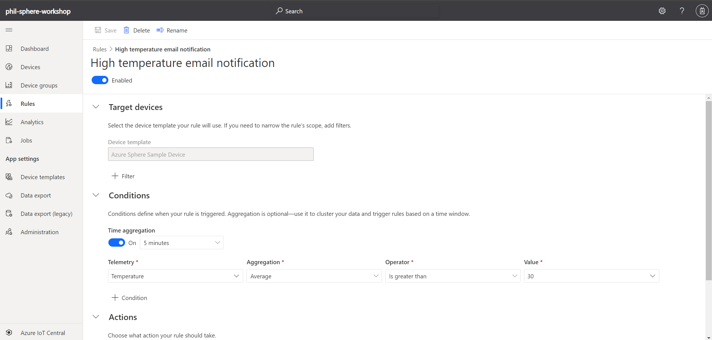
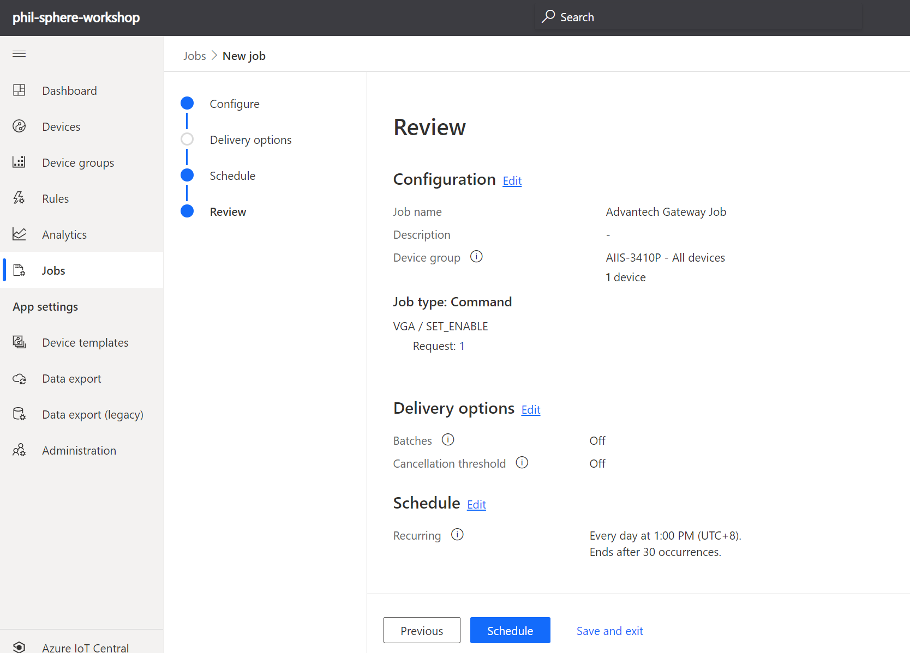
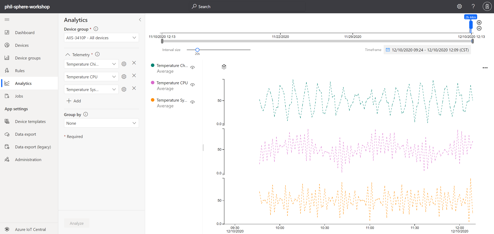

# Advance IoT Central use case with Sphere 

## Lab Environment Pre-requisites
1. Internet Access 
2. An Azure Subscription
    
    You can use your own Azure Subscription, or use below link to apply an Azure China trial subscription.    
    https://azure.microsoft.com/en-us/free/
    
3. Online RPI Simulator Access
    
    https://azure-samples.github.io/raspberry-pi-web-simulator/#GetStarted

## Pre-requisites
* Azure account: 
    Bring your own Azure account to keep all your dev works. 
    or apply one for trial https://azure.microsoft.com/en-us/free/
* Install VS Code:
    https://code.visualstudio.com/download
* Install Azure IoT Explorer:
    https://github.com/Azure/azure-iot-explorer/releases. How to use: https://docs.microsoft.com/en-us/azure/iot-pnp/howto-use-iot-explorer
* Install extensiton for VS code
    Azure IoT tools: https://marketplace.visualstudio.com/items?itemName=vsciot-vscode.azure-iot-tools
    vsciot-vscode.azure-iot-edge
    vsciot-vscode.azure-iot-toolkit

## Create a new Application on IoT Central 

https://docs.microsoft.com/en-us/azure/iot-central/core/quick-deploy-iot-central

## Connect Azure Sphere devkit simulated device to IoT Central

https://docs.microsoft.com/en-us/azure/iot-central/core/howto-connect-sphere

## Create a rule to trigger Email action while temperature too high

https://docs.microsoft.com/en-us/azure/iot-central/core/quick-configure-rules

## Create Job to trigger command to device

https://docs.microsoft.com/en-us/azure/iot-central/core/quick-configure-rules

## Analyze data on Central 

https://docs.microsoft.com/en-us/azure/iot-central/core/howto-create-analytics

## Extend Azure IoT Central with custom analytics using Azure Databricks

https://docs.microsoft.com/en-us/azure/iot-central/core/howto-create-custom-analytics

## Explore API of IoT Central 

https://docs.microsoft.com/en-us/learn/modules/manage-iot-central-apps-with-rest-api/

